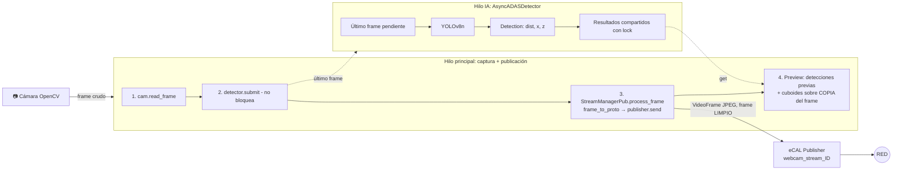
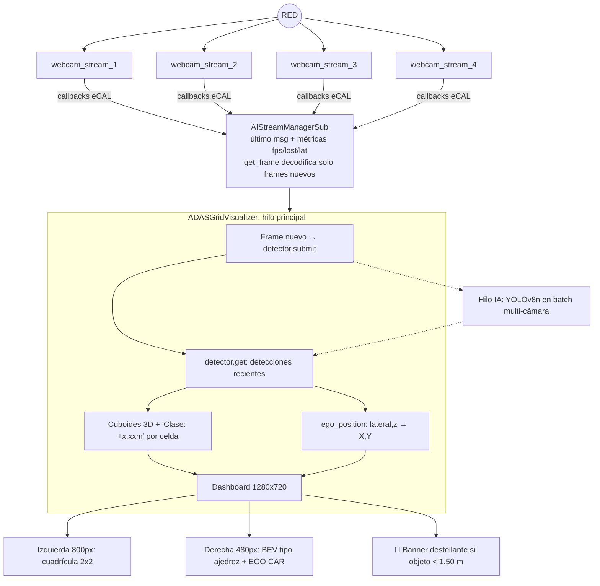

# 🚗 ADASCore — Simulación BYD ADAS sobre eCAL

Sistema de streaming de video multi-cámara sobre **eCAL** con detección de objetos **YOLOv8n**, estimación de distancia en metros, cuboides 3D por severidad y un plano cartesiano (BEV) centrado en el **EGO CAR**.

- **Emisor (`main_pub.py`)**: captura, publica por eCAL sin caídas de FPS y muestra un preview local con IA asíncrona.
- **Receptor estándar (`main_sub.py`)**: cuadrícula ligera sin IA (intacto).
- **Receptor AI (`main_sub_ai.py`)**: hasta 4 cámaras en paralelo, dashboard 1280x720 (cuadrícula 2x2 + BEV) y banner de alerta crítica.

---

## 📑 Tabla de contenido

1. [Estructura de archivos](#-estructura-de-archivos)
2. [Arquitectura y flujo de datos](#-arquitectura-y-flujo-de-datos)
3. [Explicación de cambios e integración](#-explicación-de-cambios-e-integración)
4. [Cómo ejecutarlo](#-cómo-ejecutarlo)
5. [Configuración](#-configuración)
6. [Notas y limitaciones](#-notas-y-limitaciones)

---

## 📁 Estructura de archivos

Leyenda: 🆕 nuevo · ✏️ modificado · ✅ intacto

```
ADASCore/
├── main_pub.py                          ✏️ MODIFICADO  (emisor + inferencia asíncrona + preview BYD)
├── main_sub.py                          ✅ INTACTO     (receptor ligero sin IA)
├── main_sub_ai.py                       🆕 NUEVO       (receptor AI 4 canales)
│
├── core/
│   └── imagen_pb2.py                    ✅ INTACTO
│
├── data_stream/
│   ├── pubs_stream_manager.py           ✅ INTACTO
│   ├── subs_stream_manager.py           ✅ INTACTO
│   └── ai_subs_stream_manager.py        🆕 NUEVO       (suscripción multi-canal + decodificación)
│
├── img_processing/
│   ├── __init__.py                      ✅ INTACTO
│   ├── video_serializer.py              ✅ INTACTO
│   ├── yolo_processor.py                ✅ INTACTO     (modo YOLO legacy, excluyente con --adas)
│   ├── adas_geometry.py                 🆕 NUEVO       (distancias, severidad, mapeo cartesiano)
│   └── adas_detector.py                 🆕 NUEVO       (YOLOv8n asíncrono multi-fuente)
│
├── interfaces/
│   ├── ecal_interface.py                ✅ INTACTO
│   ├── rabbitmq_interface.py            ✅ INTACTO
│   └── middleware_factory.py            ✅ INTACTO
│
├── user_interface/
│   ├── pub_visualizer.py                ✅ INTACTO
│   ├── sub_test_visualizer.py           ✅ INTACTO
│   ├── text_labels_overlay.py           ✅ INTACTO
│   ├── adas_renderer.py                 🆕 NUEVO       (cuboides 3D, grilla métrica, BEV, banner)
│   └── ai_grid_visualizer.py            🆕 NUEVO       (dashboard 1280x720)
│
├── utils/
│   ├── args_conf.py                     ✏️ MODIFICADO  (+ --adas, --adas-conf, --adas-imgsz)
│   ├── pub_sub_conf.py                  ✏️ MODIFICADO  (+ constantes ADAS)
│   ├── connection_conf.py               ✅ INTACTO
│   └── helper_functions.py              ✅ INTACTO
│
└── standalone/                          (opcional, referencia histórica)
    ├── byd_adas_simulation.py           ✅ INTACTO
    └── byd_adas_ecal.py                 ✅ INTACTO
```

---

## 📐 Arquitectura y flujo de datos

### Emisor (`main_pub.py --adas`)



> El frame publicado por eCAL es siempre el frame **limpio**. Los cuboides solo se dibujan en una copia para el preview local.

### Receptor AI (`main_sub_ai.py`)



Esquema de la pantalla:

```
┌───────────────────────────────────────────────────────────────┐
│ ████████ ALERTA CRITICA: PEATON A 1.20m (CAM 1) ████████      │  ← banner rojo destellante
├──────────────────────────────┬────────────────────────────────┤
│ CAM1 FRONTAL │ CAM2 TRASERA  │   BEV - PLANO CARTESIANO (X,Y) │
│──────────────┼───────────────│   ┌─┬─┬─┬─┬─┬─┐               │
│ CAM3 IZQ.    │ CAM4 DER.     │   │ │ │ │▣│ │ │  ← objetos    │
│              │               │   ├─┼─┼─┼─┼─┼─┤               │
│   800 px                     │   │ │ │EGO CAR│ │               │
│                              │   └─┴─┴─┴─┴─┴─┘    480 px      │
└──────────────────────────────┴────────────────────────────────┘
```

---

## 📝 Explicación de cambios e integración

### Cambios por archivo

| Archivo | Cambio |
|---|---|
| `utils/pub_sub_conf.py` | Se agrega `AdasConfig` y las constantes `FOCAL_LENGTH`, `CLASS_REAL_WIDTHS`, `CLASS_NAMES_ES`, umbrales de severidad, parámetros del BEV y `CAMERA_YAWS_DEG` (orientación de cada stream respecto al auto). Todo lo anterior queda igual. |
| `utils/args_conf.py` | Se agregan `--adas` / `--no-adas`, `--adas-conf` y `--adas-imgsz`. Todos los flags originales se conservan. Se corrigieron dos mensajes de error que decían "quality" cuando eran de width y fps. |
| `main_pub.py` | Integra `AsyncADASDetector`. El frame se entrega al hilo de IA antes de serializar y publicar. El preview dibuja los cuboides sobre una copia. **Bug corregido:** la lectura de teclas estaba dentro de `if not paused`, así que al pausar con `p` ya no se podía reanudar. Ahora está fuera, y en pausa se hace un `sleep` corto. |
| `img_processing/adas_geometry.py` | `Detection`, distancia `Z = (ancho_real × F) / ancho_px`, severidad por color y rotación cámara → EGO CAR. |
| `img_processing/adas_detector.py` | YOLOv8n en hilo propio, multi-fuente, con inferencia en batch y warm-up. |
| `user_interface/adas_renderer.py` | `draw_3d_cuboid`, `draw_metric_grid` (tablero de ajedrez), `BEVRenderer` con fondo cacheado, `draw_alert_banner` y `fit_to_cell`. |
| `data_stream/ai_subs_stream_manager.py` | Suscripción a `webcam_stream_N` vía `create_subscriber`, con métricas (FPS, latencia, pérdidas) y decodificación solo ante frames nuevos. |
| `user_interface/ai_grid_visualizer.py` | Dashboard 1280x720: cuadrícula 2x2 + BEV + banner de alerta. |
| `main_sub_ai.py` | Entry point del receptor AI con CLI propia. |

### Cómo interactúan los hilos

**Emisor**

- **Hilo principal:** `read_frame()`, `submit()` (solo asigna una referencia bajo lock), `frame_to_proto` + `send()` y el preview. La inferencia nunca está en este camino.
- **Hilo IA:** espera con un `Event`, toma el último frame pendiente y corre YOLO. Si la IA es más lenta que la cámara, descarta frames viejos en lugar de acumularlos: el streaming mantiene su FPS y la IA corre a su propio ritmo.
- El preview usa las detecciones más recientes. Si tienen más de 0.75 s (`ADAS_MAX_DETECTION_AGE_S`) se ocultan para no mostrar cajas fantasma.

**Receptor**

- **Hilos de eCAL:** un callback por stream que solo guarda el último mensaje y actualiza FPS, pérdidas y latencia. Es muy liviano.
- **Hilo principal:** `get_frame()` decodifica solo si el `frame_number` cambió y alimenta al detector.
- **Hilo IA:** procesa en un solo batch los frames de todas las cámaras activas.

### Mapeo cartesiano (X, Y)

```
Z       = (ancho_real × FOCAL_LENGTH) / ancho_px
lateral = (centro_x − W/2) × Z / FOCAL_LENGTH
```

Luego se rota según el yaw de la cámara hacia el marco del EGO CAR (X = derecha, Y = frente).

| Stream | Cámara | Yaw por defecto |
|---|---|---|
| 1 | FRONTAL | 0° |
| 2 | TRASERA | 180° |
| 3 | IZQUIERDA | 90° |
| 4 | DERECHA | −90° |

Si montas las cámaras distinto, edita `CAMERA_YAWS_DEG` en `utils/pub_sub_conf.py`.

### Severidad por color

| Color | Distancia |
|---|---|
| 🔴 Rojo | < 1.50 m (peligro / alerta crítica) |
| 🟡 Amarillo | 1.50 m – 3.00 m |
| 🟢 Verde | > 3.00 m |

---

## ▶️ Cómo ejecutarlo

### Requisitos

- Python 3.10+ (el código usa la sintaxis `str | int`)
- [eCAL](https://eclipse-ecal.github.io/ecal/) instalado con sus bindings de Python

```bash
pip install ultralytics torch opencv-python protobuf lz4 numpy
```

> `yolov8n.pt` se descarga automáticamente la primera vez (requiere internet) o puedes copiar el archivo `.pt` en la carpeta del proyecto.

### 1. Emisores (una terminal por cámara, desde la raíz de `ADASCore/`)

```bash
# Cámara frontal
python main_pub.py --stream-id 1 --camera 0 --adas

# Cámara trasera
python main_pub.py --stream-id 2 --camera 2 --adas

# Cámaras izquierda y derecha: igual con --stream-id 3 y --stream-id 4
```

Todos los flags originales siguen funcionando:

```bash
python main_pub.py --stream-id 1 --camera 0 --width 640 --height 480 --fps 30 \
                   --encoding JPEG --quality 80 --topic-prefix webcam_stream --adas
```

| Flag nuevo | Descripción |
|---|---|
| `--adas` / `--no-adas` | Activa/desactiva el preview ADAS (YOLOv8 asíncrono + cuboides 3D) |
| `--adas-conf 0.35` | Confianza mínima de detección |
| `--adas-imgsz 320` | Tamaño de inferencia (320, 416, 640) |

> ℹ️ `--adas` requiere preview local: con `--no-preview` se desactiva. Es excluyente con `--enable-yolo` (se usa ADAS).
> Si un nodo solo debe transmitir, usa `--no-preview`.

### 2. Receptor AI (terminal aparte)

```bash
python main_sub_ai.py --streams 1 2 3 4
```

| Flag | Descripción |
|---|---|
| `--streams 1 2` | IDs de streams a suscribir (1–4) |
| `--topic-prefix` | Prefijo del topic (debe coincidir con el emisor) |
| `--model` | Modelo YOLOv8 (por defecto `yolov8n.pt`) |
| `--conf` | Confianza mínima |
| `--imgsz` | Tamaño de inferencia |

### 3. Receptor ligero sin IA (sin cambios)

```bash
python main_sub.py
```

### Teclas

| Programa | Tecla | Acción |
|---|---|---|
| Emisor | `q` | Salir |
| Emisor | `p` | Pausar / reanudar |
| Emisor | `s` / `f` | Estadísticas actuales / finales |
| Emisor | `t` / `c` | Transparencia / confianza (solo YOLO legacy) |
| Receptor AI | `q` o `Esc` | Salir |
| Receptor AI | `d` | Estadísticas por cámara |

---

## ⚙️ Configuración

Todos los parámetros ADAS están en `utils/pub_sub_conf.py` (`AdasConfig`):

| Parámetro | Valor por defecto | Descripción |
|---|---|---|
| `focal_length` | 700.0 | Focal estimada, calibrada para `reference_width_px` |
| `reference_width_px` | 640 | Ancho de frame de la calibración (la focal se escala si cambias `--width`) |
| `danger_m` / `warning_m` | 1.50 / 3.00 | Umbrales de severidad |
| `max_detection_age_s` | 0.75 | Detecciones más viejas se descartan |
| `stream_timeout_s` | 2.0 | Sin frames por este tiempo = cámara inactiva |
| `alert_blink_hz` | 2.0 | Destellos por segundo del banner |
| `bev_ppm` | 80 | Píxeles por metro en el BEV |
| `bev_cell_m` | 0.5 | Lado de cada celda del tablero (m) |

Para agregar clases, edita `CLASS_REAL_WIDTHS` y `CLASS_NAMES_ES` (ancho físico promedio en metros, por ID de clase COCO).

---

## ⚠️ Notas y limitaciones

- **Acentos:** `cv2.putText` no dibuja `ó` ni `ñ`, por eso "Peatón" se renderiza como "Peaton". Es una limitación de las fuentes de OpenCV.
- **Latencia en el receptor:** usa el `timestamp` del emisor, así que solo es fiable si ambos equipos tienen los relojes sincronizados.
- **Rango del BEV:** con 80 px/m se ven ±3 m laterales y ±4.5 m al frente. Lo que queda fuera se fija al borde con la marca `>>`. Ajusta `bev_ppm` según lo que necesites.
- **Distancias estimadas:** se calculan a partir del ancho físico promedio por clase y una focal aproximada; son una estimación, no una medición calibrada.
- **Sin pruebas en hardware:** el código no se probó con cámaras reales ni con eCAL.
- **Archivos no incluidos al generar:** `subs_stream_manager.py`, `rabbitmq_interface.py` y `sub_test_visualizer.py` se dejaron intactos; el receptor AI no depende de ellos.
